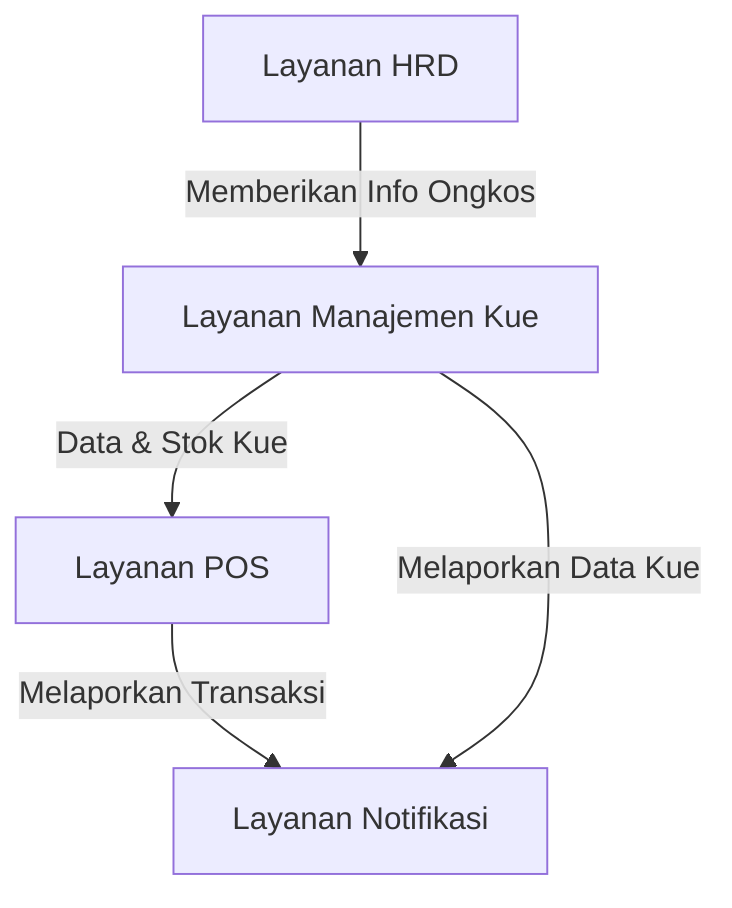

Pak Abdul telah menjalankan usaha penjualan kue selama lebih dari satu tahun. Selama ini, seluruh transaksi penjualan dicatat secara manual menggunakan buku tulis. Pendekatan ini awalnya dirasa cukup, namun seiring berjalannya waktu, muncul berbagai kendala dalam pengelolaan data dan pengambilan keputusan bisnis. Buku catatan yang digunakan sering hilang atau terselip, sehingga menyulitkan Pak Abdul dalam memantau perkembangan usaha secara menyeluruh.

Selain itu, Pak Abdul belum memiliki perhitungan yang jelas dan akurat terkait harga pokok produksi (HPP) dan harga jual kuenya. Hal ini membuat proses penetapan harga sering kali dilakukan berdasarkan perkiraan, tanpa analisis yang tepat terhadap biaya bahan baku, tenaga kerja, dan keuntungan yang diinginkan.

- **Permasalahan**
    - Data penjualan dicatat secara manual dan sering kali tidak terdokumentasi dengan baik karena buku catatan mudah hilang atau terselip.
    - Sulitnya melacak riwayat transaksi penjualan dan perkembangan usaha dari waktu ke waktu.
    - Tidak adanya sistem yang dapat membantu menghitung harga pokok produksi secara otomatis.
    - Penentuan harga jual tidak berdasarkan analisis biaya dan margin keuntungan yang jelas.
  
- **Tugas Anda**
    Buatlah sebuah aplikasi yang dapat membantu Pak Abdul dalam mengelola usahanya.
    Aplikasi ini terbagi menjadi 4 layanan utama:
    1. **Layanan POS (Point of Sale)**: Untuk mencatat dan melaporkan transaksi penjualan kue secara otomatis, sehingga data penjualan dapat terdokumentasi dengan baik.
    2. **Layanan Manajemen Kue**: Untuk mengelola data kue, termasuk jenis, harga pokok produksi, dan harga jual.
    3. **Layanan HRD (Human Resource Department)**: Untuk mengelola data tenaga kerja yang terlibat dalam produksi kue, termasuk gaji dan jam kerja.
    4. **Layanan Notifikasi**: Untuk mengirimkan notifikasi kepada Pak Abdul terkait transaksi penjualan, perubahan harga, dan informasi penting lainnya.

### Gambaran Flow

### Gambaran Arsitektur

```mermaid
architecture-beta
    group internal(cloud)[Internal Services]

    group pos(cloud)[POS Service] in internal

    service pos_db(logos:postgresql)[gx_pos_db] in pos
    service pos_server(server)[gx_pos_server] in pos
    pos_db:L -- R:pos_server

    group cake(cloud)[Cake Service] in internal

    service cake_db(logos:mysql)[gx_cake_db] in cake
    service cake_server(server)[gx_cake_server] in cake
    cake_db:L -- R:cake_server

    pos_server:T -- B:cake_server

    group hrd(cloud)[HRD Service] in internal
    service hrd_db(logos:mysql)[gx_hrd_db] in hrd
    service hrd_server(server)[gx_hrd_server] in hrd
    hrd_db:L -- R:hrd_server

    pos_server:B -- T:hrd_server

    group notification(cloud)[Notification Service] in internal
    service notification_db(logos:postgresql)[gx_notification_db] in notification
    service notification_server(server)[gx_notification_server] in notification
    service notification_queue(logos:rabbitmq)[gx_notification_queue] in notification

    notification_db:L -- R:notification_server
    notification_server:T -- B:notification_queue

    pos_server:L -- R:notification_queue
    cake_server:L -- R:notification_queue
    
```

### Fitur Per Layanan
- **Layanan POS (pos)**
    - Input data penjualan kue secara real-time.
    - Melaporkan transaksi penjualan ke Layanan Notifikasi.
    - Menyediakan laporan penjualan harian, mingguan, dan bulanan.

- **Layanan Manajemen Kue (cake)**
    - Input data kue (nama, deskripsi, margin(%)).
    - Input data bahan baku kue. (nama, deskripsi, harga per unit, unit)
    - Input data resep kue.
    - Input data ongkos per kue.
    - Menghitung harga pokok produksi (HPP) berdasarkan bahan baku dan ongkosnya.
    - Produksi kue berdasarkan bahan baku yang tersedia dan ongkos yang telah ditentukan (update stok & harga jualnya juga).

- **Layanan HRD (hrd)**
    - Input data tenaga kerja beserta gaji dan jam kerja harian.

- **Layanan Notifikasi (notification)**
    - Mengirimkan notifikasi kepada Pak Abdul terkait transaksi penjualan dan perubahan harga.

### Struktur Data Per Layanan
- **pos**
    - `Transaksi`: Struktur data untuk menyimpan informasi transaksi penjualan, termasuk ID transaksi, ID kue, jumlah yang terjual, dan waktu transaksi.
    - `Kue`: Struktur data untuk menyimpan informasi kue yang dijual, termasuk ID kue, nama, deskripsi, dan harga jual.
- **cake**
    - `Kue`: Struktur data untuk menyimpan informasi kue, termasuk ID kue, nama, deskripsi, margin(%), dan harga jual.
    - `BahanBaku`: Struktur data untuk menyimpan informasi bahan baku, termasuk ID bahan, nama, deskripsi, harga per unit, dan unit.
    - `Resep`: Struktur data untuk menyimpan informasi resep kue, termasuk ID resep, ID kue, dan daftar bahan baku beserta takarannya.
    - `Ongkos`: Struktur data untuk menyimpan informasi ongkos produksi per kue, termasuk ID kue, jenis ongkos dan ongkos.
- **hrd**
    - `TenagaKerja`: Struktur data untuk menyimpan informasi tenaga kerja, termasuk ID tenaga kerja, nama, gaji, dan jam kerja harian.
- **notification**
    - `Notifikasi`: Struktur data untuk menyimpan informasi notifikasi, termasuk ID notifikasi, jenis notifikasi, dan waktu pengiriman.