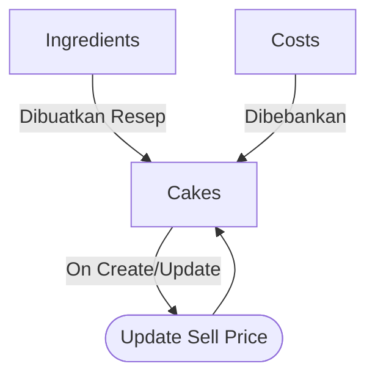

Pak Abdul telah menjalankan usaha penjualan kue selama lebih dari satu tahun. Selama ini, seluruh transaksi penjualan dicatat secara manual menggunakan buku tulis. Pendekatan ini awalnya dirasa cukup, namun seiring berjalannya waktu, muncul berbagai kendala dalam pengelolaan data dan pengambilan keputusan bisnis. Buku catatan yang digunakan sering hilang atau terselip, sehingga menyulitkan Pak Abdul dalam memantau perkembangan usaha secara menyeluruh.

Selain itu, Pak Abdul belum memiliki perhitungan yang jelas dan akurat terkait harga pokok produksi (HPP) dan harga jual kuenya. Hal ini membuat proses penetapan harga sering kali dilakukan berdasarkan perkiraan, tanpa analisis yang tepat terhadap biaya bahan baku, tenaga kerja, dan keuntungan yang diinginkan.

- **Permasalahan**
    - Data penjualan dicatat secara manual dan sering kali tidak terdokumentasi dengan baik karena buku catatan mudah hilang atau terselip.
    - Sulitnya melacak riwayat transaksi penjualan dan perkembangan usaha dari waktu ke waktu.
    - Tidak adanya sistem yang dapat membantu menghitung harga pokok produksi secara otomatis.
    - Penentuan harga jual tidak berdasarkan analisis biaya dan margin keuntungan yang jelas.

### Gambaran Flow

### Fitur Sistem
- Input data kue (nama, deskripsi, margin(%)).
- Input data bahan baku kue. (nama, deskripsi, harga per unit, unit)
- Input data resep kue.
- Input data ongkos per kue.
- Menghitung harga pokok produksi (HPP) berdasarkan bahan baku dan ongkosnya.
- Produksi kue berdasarkan bahan baku yang tersedia dan ongkos yang telah ditentukan (update stok & harga jualnya juga).

### Struktur Data 
- `Cake`: Struktur data untuk menyimpan informasi kue, termasuk ID kue, nama, deskripsi, margin(%), dan harga jual.
- `CakeComponentIngredient`: Struktur data untuk menyimpan informasi bahan baku, termasuk ID bahan, nama, deskripsi, harga per unit, dan unit.
- `CakeRecipeIngredient`: Struktur data untuk menyimpan informasi resep kue, termasuk ID resep, ID kue, dan daftar bahan baku beserta takarannya.
- `CakeCost`: Struktur data untuk menyimpan informasi ongkos produksi per kue, termasuk ID kue, jenis ongkos dan ongkos.

#### Pengembangan Berikutnya

Menambahkan fitur transaksi penjualan kue, yang mencakup:
- Input data penjualan ID Transaksi, jumlah kue, total harga, dan tanggal penjualan.
- Input detail penjualan, termasuk ID kue, jumlah yang terjual, dan harga jual per unit.

*Struktur data untuk transaksi penjualan:*
- `Transaction`: Struktur data untuk menyimpan informasi transaksi penjualan, termasuk ID transaksi, tanggal, dan total harga.
- `TransactionDetailCake`: Struktur data untuk menyimpan detail penjualan, termasuk ID transaksi, ID kue, jumlah yang terjual, dan harga jual per unit.