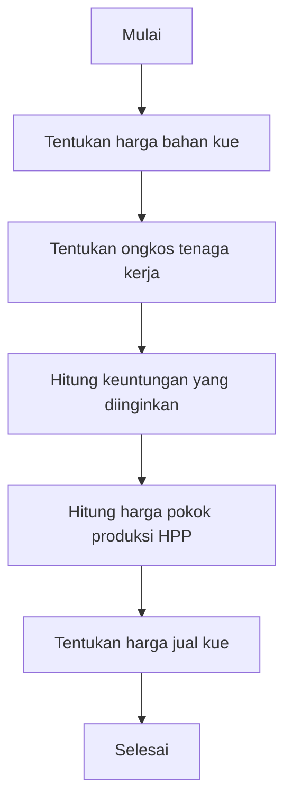

Langkah langkah yang harus diambil pak Abdul untuk mengatasi permasalahan ini

1. Menentukan harga bahan kue yang digunakan dalam produksi kue, termasuk bahan baku utama seperti tepung, gula, telur, dan bahan tambahan lainnya. Hal ini penting untuk menghitung harga pokok produksi (HPP) secara akurat.
2. Menentukan ongkos tenaga kerja yang terlibat dalam proses produksi kue, termasuk gaji karyawan atau upah harian jika menggunakan pekerja lepas.
3. Menghitung keuntungan yang diinginkan dari setiap jenis kue yang dijual.

Flowchart untuk langkah-langkah di atas:

Fitur-fitur yang harus ada dalam aplikasi:
- **Input Data Bahan Kue**: Formulir untuk memasukkan harga bahan baku utama dan tambahan yang digunakan dalam produksi kue.
- **Input Data Tenaga Kerja**: Formulir untuk memasukkan ongkos tenaga kerja yang terlibat dalam produksi kue.
- **Perhitungan Harga Pokok Produksi (HPP)**: Sistem yang secara otomatis menghitung HPP berdasarkan data bahan kue dan ongkos tenaga kerja yang telah dimasukkan.
- **Input Data Kue**: Formulir untuk memasukkan jenis kue yang dijual, termasuk nama, deskripsi, dan harga jual.
- **Perhitungan Harga Jual**: Sistem yang menghitung harga jual kue berdasarkan HPP dan keuntungan yang diinginkan.

Struktur data yang diperlukan:
- **Bahan Kue**: Struktur data untuk menyimpan informasi tentang bahan kue, termasuk nama, harga per unit, dan jumlah yang digunakan
- **Tenaga Kerja**: Struktur data untuk menyimpan informasi tentang ongkos tenaga kerja, termasuk jenis pekerjaan dan biaya per hari.
- **Kue**: Struktur data untuk menyimpan informasi tentang jenis kue, termasuk nama, deskripsi, HPP, dan harga jual.
- **Riwayat HPP dan Harga Jual**: Struktur data untuk menyimpan riwayat perubahan HPP dan harga jual setiap jenis kue, sehingga Pak Abdul dapat melacak perkembangan usaha dari waktu ke waktu.